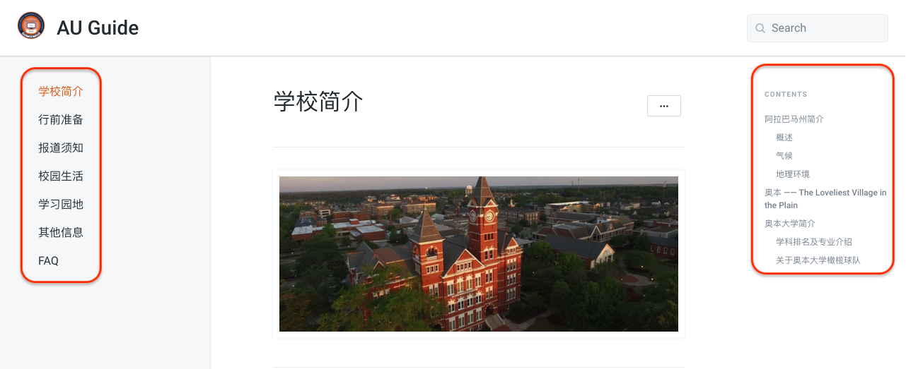

# 奥本大学新生手册

## 卷首语

奥本大学的同学和朋友们大家好！

为了方便新来的小伙伴们更细致的了解有关奥本大学的方方面面，也为了帮助已在奥本的同学们对奥本的生活和学习有更加系统全面的了解，我们在此正式推出AUSSA版奥本大学新生手册。

本手册欢迎奥本大学所有同学或校友积极投稿，致力于成为学长学姐们为奥本的广大中国留学生群体贡献自己的经验和智慧并集结成册长期保存的平台。基于此，本手册将本着开放互助的原则，在尊重原创者意愿的前提下为其署名。

本手册是所有贡献者集体智慧的结晶，由AUSSA编辑整理。版权由AUSSA所有。为奥本大学学生提供免费便捷的资讯服务。欢迎非商业用途转载，但请注明出处。

祝你在奥本大学的学习和生活充实而精彩！

War Eagle！

## 如何阅读本书

* 如果你使用电脑浏览，可以在左侧看到这本书的目录，点进去具体某个目录的章节后，可以在右侧看到这个章节的子目录：

## 联系和招募

微信公众号：AuburnSSA

投稿：admin@aussa.org

## 更新历史

2018.04.18 正式上线

