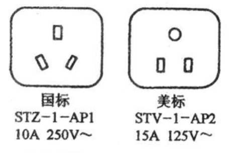

# 行前准备

##  行前准备

本清单主要从精简的角度出发，结合奥本的具体情况（不一定适用于美国其他地区），在分析价格差异，实用性，以及便携性后，列举出**最基本，最重要**的物品清单。

清单分为以下几大类：

* 重要文件
* 现金和信用卡
* 电子电器
* 生活用品
* 文具和书籍
* 衣服
* 床上用品
* 药品

### 重要文件[¶](https://guide.sbuforum.com/prep/shopping/#_2) {#_2}

* **I-20**
* **护照**
* **Offer Letter （录取信）**
* **国内成绩单**
* **学校要求的体检表和疫苗表**（这个也可以在来之前先寄给学校）
* **I-94**（这个文件在入境美国前是**没有的**，只有当你在美国海关**入境之后**才能在网上打印，一般学校会帮助打印并钉在护照上，因为I-94也属于重要文件，所以小编列在了这里）。

以上文件在新生orientation的时候都要用到，而且是在美国生活证明身份的重要文件，建议大家妥善保管，并留好**复印件**和文件照片，以防丢失

### 现金和信用卡[¶](https://guide.sbuforum.com/prep/shopping/#_3) {#_3}

* **双币或全币信用卡** 美国的消费基本都能用信用卡解决，用现金的地方很少。
* **现金** 现金的数额根据个人喜好即可，携带现金如果**超过一万美金**入海关时是需要申报的，切记。

### 电子电器[¶](https://guide.sbuforum.com/prep/shopping/#_4) {#_4}

* 常用电器 台灯，电水壶，吹风机等由于中美电压不同，是无法正常工作的，所以不需要带过来，
  这边的价格都不贵。男生如果想带国内的剃须刀的话，要看清楚是否支持110V电压。
* 转换插头与插排 中国的双口插头可以直接在美国使用，三口插头需要转换器才能使用，所以如果有三口插头的电器的话（比如笔记本电脑），可以带转换插头来。不推荐带插排，因为大部分美国电器的插头无法在国内的插排上使用，并且这边的插排价格和国内差不多。也有例
  外，例如Apple产品的电源是可以直接在美国用的。
* 笔记本电脑和智能手机 如果要买新的话，建议到美国买，因为价格会比国内便宜不少，并且退货和售后服务都
  很方便。110V电压下，国内的笔记本电脑基本上都能正常使用。但是大部分国内的手机，在美国充电时会很慢，大家可以把手机连到电脑上去冲。
*  USB数据线 多备几条，国内地摊上10元就能买一根，到美国就很贵了。
* 电池 
  美国的电池比国内要贵一些，大家可以带几节5号，7号，以及纽扣电池备用。
* 手机卡 
  可以提前开通国际漫游，或者去某宝买一个那种7天或30天的临时卡，到美国给家人报平安用。大家到美国后再办理美国当地运营商的手机卡即可。 

### 电脑软件

学校里可以免费装正版的操作系统，而且学校官网有很多免费的常用软件下载，包括微软的office等。美国对盗版软件打击的很严格，虽然入海关时基本上不会打开电脑检查，但是建议大家不要携带盗版软件。（关于学校里的一些免费服务，大家可以参考论论坛里这个帖子“新生可能不知道的免费校园服务”\)\*

### 生活用品

* 眼镜与墨镜
* 建议多带一副眼镜备用，如果有条件的话留好验光记录，因为美国验光的价格较贵。另外美国天晴时，太阳光线普遍比国内强，出门旅游的话墨镜是必需品，墨镜的镜片最好偏振光功能的。
* 针线包 用来缝补一些东西，有备无患。
* 卫生及洗浴用品 梳子，小镜子，毛巾，浴巾，拖鞋，挖耳勺，指甲刀，等物品体积较小，价格便宜，建议从国内带。牙膏，洗发露，洗衣液等液体物品可以不建议大量托运，学校SAC的超市里就能买到，也可以周末做校车到沃尔玛等大型超市买。可以带一两块洗澡用的香皂。另外，如果你习惯手洗内衣内裤的话，建议带一两块洗衣用的肥皂。虽然香皂在华人超市里都能买到，但是价格比国内贵不少
* 餐具 筷子建议带一双（亚洲超市才有卖），其他餐具看个人喜好了，不用必须带，因为食堂里的一次性的餐具是可以随便用的。至于锅碗瓢盆，餐刀菜板什么的，在沃尔玛里买即可，价格不贵。
* 纸笔 在飞机快到站时填写入境表，申报单的时候会用到哦！
* 文具

  文具的体积小，重量轻，而且国内的价格比美国便宜不少，所以建议从国内带一些常用的文具，比如圆珠笔，笔芯，铅笔，橡皮，剪刀，订书机，小夹子，便利贴等。

* 本子

  美国的本子比国内稍贵，但考虑到重量，可以少带一些。美国用的活页纸和国内的尺寸不一样，所以活页纸建议到这边买，因为大部分手写的作业都要写在活页纸上。

* 书籍

  美国的书价格太贵，可以从国内带一些书过来，考虑到书会占很多重量，所以建议大家能搜到电子版的书就没必要带了，况且在美国的学习任务普遍较重，课本都不一定能看一遍，更别说带来的其他书了，所以小编认为大家带少量工具书（类似GRE红宝书那样的）和自己认为有重要价值或意义的书即可。

* 计算器

  关于计算器，买普通的科学型计算器就好，不要买那种有绘图功能的高端计算器，因为学校里的考试是禁止使用有绘图功能的计算器的（好像大多数参加过AP考试的同学都有那种可以绘图的高端计算器）学校Book Store里有卖那种可以在考试时候使用的科学型计算器，价格也不贵，怕买错的同学可以到这边再买。

### 衣服

奥本冬季最冷的时候气温大概在-1摄氏度左右，所以建议大家带一件羽绒服来防寒。学校冬季室内供暖充足，大家在室内都会脱下外套只穿一层长袖T恤甚至是短袖T恤。内穿的秋衣基本上不会用，因为公共场合穿一件秋衣确实感觉很不得体，但是秋裤在美国很难买到，所以
长袖T恤短袖T恤和秋裤可以带几件，内穿的秋衣尽量少带。袜子和内衣内裤可以从国内多带一些，因为国内的价格相对便宜，而且不占空间。手套的话，建议从国内带，因为国内的款式比美国稍多一些，而且价格便宜。鞋垫也可以带几双过来，因为美国的超市里不太容易买到。

除此之外，小编认为日常穿的衣服和鞋子还有西服，皮鞋等正装，大家最好都在美国买，毕
竟这边相同品牌的衣服和鞋子在价格上都比国内便宜，而且质量也好。Auburn Mall和Tiger Town的各种服装店基本能满足大家中高端的消费需求了。沃尔玛也有很多非名牌的低价衣服和鞋，满足大家的低端消费需求。小编曾经在沃尔玛买了几双十几美金的鞋，虽然是杂牌的，连鞋盒
都没有，但是外观和质量都很好。另外，在12月份的黑色星期五，大家也可以亚特兰大的outlet买到各种打折的名牌衣服和鞋。
更多关于购物的内容，大家可以参考这篇帖子“奥本周边商店和购物”可以查到学校周边商店的详细列表

### 床上用品


学校宿舍里床的大小为1m x 2m，床上只有一个床垫。所以建议大家从只从国内带床单，枕套和被套。被子芯和枕头芯到这边后，去沃尔玛买。


如果对床上用品很挑剔的话，也可以全部都从国内带。美国的枕头芯普遍较大，不喜欢高枕头的同学，可以从国内带一个适合自己的枕头芯，不过确实不方便。当然也可以来了买，直接买记忆枕，还比国内便宜。


凉席的话，推荐带一副亚麻席。因为石溪夏天气温一般在20度左右，夜间温度会更低一些，所以夏天晚上睡觉是不需要空调的，所以大家带亚麻席足够。

### 药品

大家交的医疗保险已经覆盖了大部分的药品了，平时感冒发烧嗓子疼的可以直接去health center免费领药，所以药品不需要带太多。


携带药品的种类一般是这些：感冒发烧类，过敏类，止咳类，止泻类，清热去火类等。另外还有风油精，创可贴等。中药也可以带一些。一般常用的处方中西药可携带通过安检处，但有时可能要求出示需求证明。


中药类产品必须是无寄生类植物。珍贵的中药材如蛇胆、豹骨、虎皮、鹿茸等属于保育类动物，严禁携入美国，寄生类植物如兔丝子、石斛等也禁止携入，含可卡因类禁止禁止带入。所以带中药的同学一定要事先查清楚所带药物是否被禁止。

### 娱乐休闲用品

如果大家的行李箱里还有空间的话，不妨带一些休闲娱乐的用品，例如围棋，扑克，三国杀等等

### 结语


基本的物品清单就是这些了，其他的比如带几瓶老干妈啦，带几包辣条啦等等，大家自己发挥吧！


清单列完啦，贴心的小编再给大家几个小建议 O\(∩\_∩\)O

1. 大家可以到美国的亚马逊官网，通过查询各个商品在美国的平均物价，来取舍是否携带该物品。
2. 在网上提前查好美国入境禁止携带的物品，比如\[中华人民共和国海关总署官网上的美国入境须知\]\[1\]
3. 如果父母给大家准备了很多不必要的物品，能带的还是最好还是带上吧，毕竟出远门了不要让父母担心。
4. 转机的同学，一定要弄清楚自己的行李在转机的时候是否需要自己去领，小编有个朋友在转机时，就把行李忘了在机场了。

## 体检表格

出国前要做体检&打疫苗，学校需要你提交三个表，可以在[ Student Health Service – Forms](http://studentaffairs.stonybrook.edu/shs/forms.html)下载。

到所在当地的出国体检疫苗接种点（自行百度）。小时候的疫苗卡如果还找得到就可以少打几针，找不到的话疫苗就要全部重新打了（还好不多）。。。总共三个表格+一个健康证+一个疫苗证。我记得三个表格好像是如果要医生帮你填表格的话多收费。但是自己填的话真心不知道在说什么也不知道要写什么，还是乖乖交钱让他们填吧。疫苗我记得是要打脑膜炎疫苗和MMR三联针，MMR每两针之间间隔1个月，打不完可以过来到student health center \(union 旁边\)打，随到随打，保险cover的。

要注意的是，刚来的前一两个星期你的保险可能还在处理中，solar还是会charge你，需要手动寄表格什么的去报销（MMR一针$50\)。如果不想搞那么麻烦稍微晚一点去，或者到health center前台先去问一下。

Health form应该要求的是寄到学校，但是我春季入学，弄完也比较晚了，就没有寄。不寄没关系，orientation第一天的时候会有台子在会场门口收，到时候直接把表格和小黄本子都交给他们就行了。

注：Health form里面的print name意思就是说让你填写的时候不要用草书，整整齐齐地写，怕有人草书，认不清楚。有百度知道说print name是大写，也不对的。

体检的小黄本小橙本过来都带着\(小黄本小橙本是什么你体检完就知道了\)。机场什么的是不用这些的，但是orientation有可能会用（就是你之前没交那些health form的话会比较重要）。

## 手机通讯

刚到落地没办美国号码时，以及晚上到达宿舍late night check需要找RA的时候，通讯有以下几个方法：

* 国内手机号开通国际漫游。
* 来之前在淘宝买一个7天或30天的美国电话卡，到这边先临时用着。
* 提前在手机上装好skype并充值，到学校连上Wolfie Guest的wifi，然后用skype打电话。

